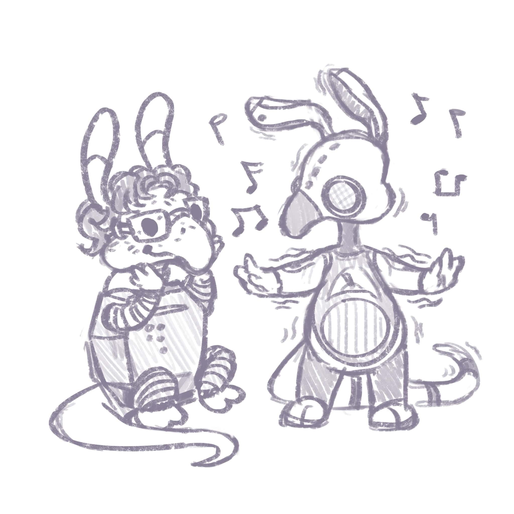

# Jukebot

Small Discord bot to play music forever! *(bring your own music! Currently only supports `.mp3` files.)*

*tbh this was just a good excuse to fiddle around with Docker.*

## Environment Variables

To run this project, you will need to add the following environment variables to your `.env` file: (see `.env.example`)

- `BOT_TOKEN` - [Your Discord bot's token.](https://discord.com/developers/applications)

## Deployment

To deploy this project, run

```bash
  docker build -t jukebot . && docker run -it -v "$(pwd)"/cogs:/app/cogs -v "$(pwd)"/music:/app/music  --rm --name running-jukebot jukebot
```

*TODO: make that into a docker-compose*

## Notes

- At the moment, this is hardcoded to work with one server and one channel within the server using their IDs. This may or may not change.

## Community Fanart


Drawn by **Mimble 🍄 - (One Umbrella#0520)**
